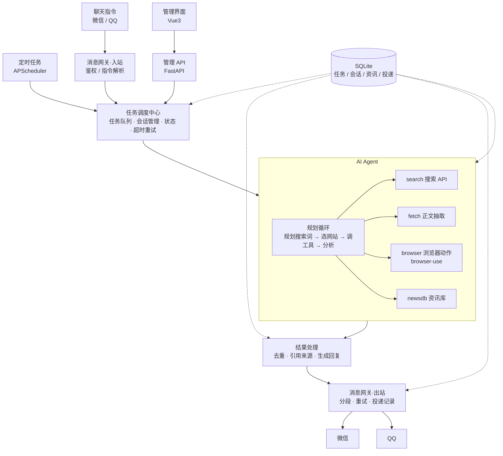
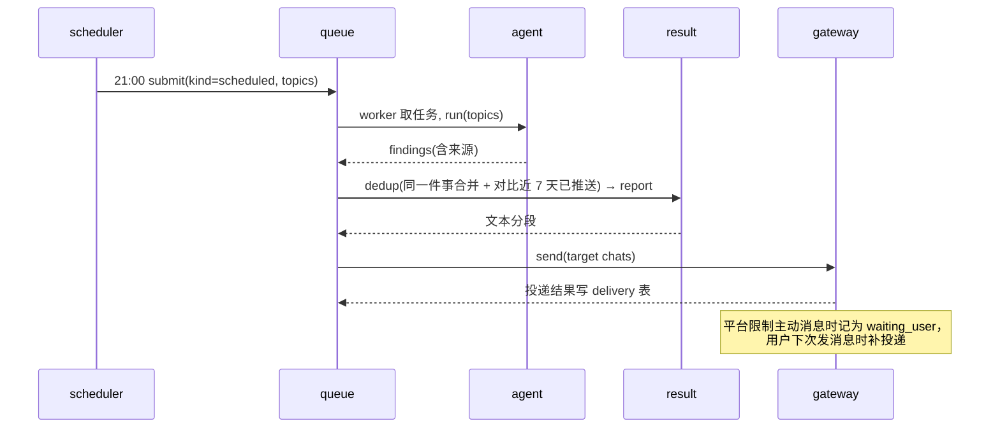
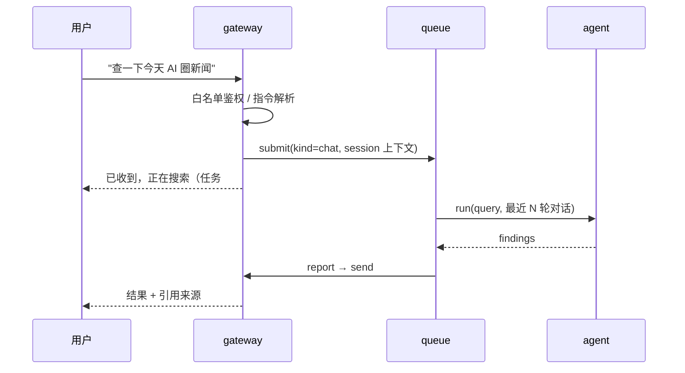
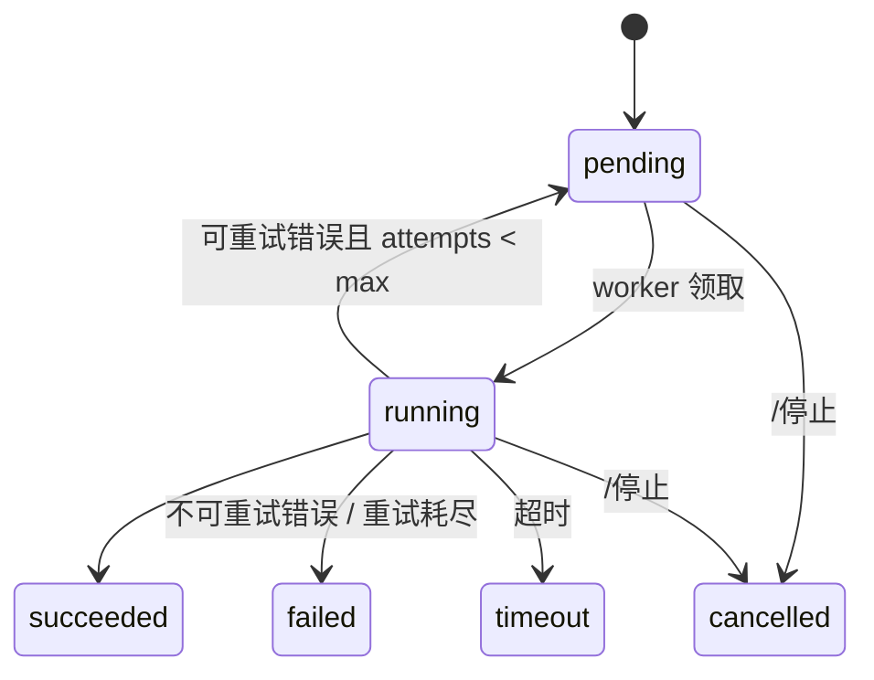

# 01 架构设计

## 1. 目标与场景

由大模型驱动搜索引擎和浏览器采集资讯，汇总后推送到微信 / QQ。两种场景**共用同一个 Agent 引擎**，只是触发方式不同：

| 场景 | 触发 | 说明 |
| --- | --- | --- |
| S1 定时推送 | 调度器（默认每天 21:00，Asia/Shanghai） | 按订阅主题生成日报，与历史推送去重后发送 |
| S2 聊天指令 | 微信 / QQ 收到消息 | 立即回执，长任务后台执行，完成后回复结果；支持追问 |

## 2. 总体架构



## 3. 技术选型

| 层 | 选型 | 理由 |
| --- | --- | --- |
| 语言 | Python 3.12 | browser-use、hermes-agent 均为 Python，可直接复用 |
| 包管理 | uv | 快、锁文件可复现 |
| API / Web | FastAPI + Uvicorn | 异步、自带 OpenAPI |
| 调度 | APScheduler 3.x（AsyncIOScheduler + SQLAlchemyJobStore） | 进程内 cron，持久化，无需额外中间件 |
| 任务队列 | asyncio 队列 + `task` 表持久化 | 单用户场景，不引入 Redis / Celery |
| 存储 | SQLite（WAL）+ SQLAlchemy 2.0 async + Alembic | 零运维；后续可切 PostgreSQL |
| LLM | OpenAI 兼容接口（openai SDK） | 可接 DeepSeek / 通义 / GPT 等 |
| 浏览器驱动 | browser-use + Chromium | 开源成熟的浏览器自动化内核；我们直接用它的动作原语，不由它规划（pip 依赖，不拷贝） |
| 搜索 API | 内置 `feeds`（按行业订阅权威 RSS）/ Bing / SearXNG / Tavily，统一接口 | 低成本优先走搜索，浏览器兜底 |
| 正文抽取 | httpx + trafilatura | 静态页面无需启动浏览器 |
| 消息网关 | 裁剪移植 hermes-agent `gateway/`：微信 = 腾讯 iLink Bot API（HTTP 长轮询），QQ = 官方 Bot API v2（WebSocket + REST）；httpx + websockets | MIT 协议，成熟；见 [08-porting.md](08-porting.md) |
| 管理界面 | Vue 3 + Vite + TypeScript + Naive UI | 轻量，构建后由 FastAPI 托管静态文件 |
| 测试 | pytest、pytest-asyncio、respx、pytest-cov；vitest | 见 [05-testing.md](05-testing.md) |
| 质量 | ruff（lint + format）、mypy | 由 `scripts/check.py` 统一执行 |
| 部署 | Docker Compose | 单机一键启动 |

## 4. 模块说明

| 模块 | 目录 | 职责 | 关键接口 |
| --- | --- | --- | --- |
| core | `src/newsbot/core/` | 配置、日志、数据库、ORM 模型、错误类型、LLM 客户端 | `settings`、`get_logger()`、`session()`、`llm.chat()` |
| gateway | `src/newsbot/gateway/` | 平台适配器（微信 / QQ）、白名单鉴权、聊天指令、入站路由、出站投递 | `BaseAdapter`、`MessageEvent`、`router.send()` |
| dispatcher | `src/newsbot/dispatcher/` | 任务队列与 worker、超时重试取消、会话上下文、定时调度、执行流水线 | `queue.submit()`、`queue.cancel()`、`scheduler.sync()` |
| agent | `src/newsbot/agent/` | 规划循环 + 工具（search / fetch / browser / newsdb） | `runner.run(query, ctx) -> Findings` |
| result | `src/newsbot/result/` | 内容去重、引用编号、摘要成稿、按平台格式化与分段 | `dedup.keep_indexes()`、`report.build()` |
| api | `src/newsbot/api/` | 管理后台 REST、登录鉴权、托管前端静态资源 | `/api/*` |
| web | `web/` | 管理界面：仪表盘、任务、定时任务、资讯库、推送记录、设置 | — |

### 4.1 Agent 内核设计

只有一个规划循环（`agent/runner.py`）：LLM tool-calling，负责拆解问题、生成检索词、判断信息是否充分、决定何时收手。设有步数与 token 预算。

**提示词只给目标与底线，不给流程**（`agent/prompts.py`）：说明工具各自的能力、判断标准与不可协商的约束，具体用哪个工具、按什么顺序、用几次由模型自己判断。每步要求模型先用一两句话说明"打算查什么、为什么"——这既是可观测的规划产物（`runner.py` 记进日志），也让检索词的提炼归位到规划阶段。

**检索词由模型负责提炼**（`agent/tools/search.py`）：工具只按空白与标点切词并逐个匹配，不做停用词过滤、同义改写或窗口切分。部分命中时如实反馈"哪些词没有任何条目同时包含"，让模型据此改写检索词——把反馈信号删掉，规划能力就永远长不出来。

**订阅源按行业分组并带质量权重**（`core.config.default_feeds`）：每个源声明 `weight`（官方源/一线媒体 1.0～1.2，聚合与消费级媒体 0.7～0.9）与 `topics`（AI / 开发 / 科技 / 芯片 / 硬件）。权重参与检索排序，也是同一件事被多家报道时决定"保留哪一条"的依据。**只收录实测可直连且能解析出真实文章地址的源**，被排除的源连同实测结论写在配置里（`36kr.com/feed` 返回验证拦截页、`github.blog/feed` 等连接超时）。营销导购条目（"XX Promo Codes"）在解析阶段丢弃——实测 Wired 的 feed 里十有六条是这类内容。

**浏览器不套子 Agent**（`agent/tools/browser.py`）：`browser` 工具把 browser-use 的动作原语（open / click / type / scroll / keys / back / tabs / switch / text）直接交给主 Agent，由它自己看页面元素编号并决定下一步。浏览器侧因此**不需要任何 LLM 调用**。会话启动后会先探测 CDP 是否真的可用再返回（`start()` 返回不代表能接受指令）；连接类错误会丢弃会话并在下次调用重建；失败原因按"会话断开 / 页面拒绝 / 超时 / 元素编号失效"分类后回灌，让模型能决定重试、换页面还是换工具。

优先级：`newsdb`（已有）→ `search` → `fetch` → `browser`。大部分问题在前三步解决，浏览器只在需要登录态、动态渲染或交互时使用。

### 4.2 内容去重

去重依据是**内容**，不是来源（`result/dedup.py`）：不同媒体报同一件事要合并，同一家媒体的两条不同新闻都要保留——按来源去重会把一个媒体一天的多条新闻压成一条，那是丢失而不是去重。

判据是**词法 + 语义**两层，词法是可靠底座，语义只补词法的盲区：

| 层 | 判据 | 说明 |
| --- | --- | --- |
| 词法 | 网址相同 / 内容指纹相同 | 同一篇文章、逐字转载 |
| 词法 | **共带数字的标识符** | `qwen-image-2.1-turbo`、`cgroup-v2`——唯一能跨中英文对齐同一件事的证据 |
| 词法 | 词集相似度 ≥ 0.6 | 近逐字转载。实测真实订阅源里**不同话题**相似度上限只有 0.17，不会误伤 |
| 语义 | 一次 LLM 调用判断"这几条是不是同一件事" | 补词法盲区：中文改写、无版本号的纯中文事件（如「Musk 与 Ambani 就 Starlink 互怼」对英文原稿） |

被实测否掉的词法判据：用"共享若干普通拉丁词"判重会误删——「Alibaba Qwen Releases X」与「JetBrains Releases Y」共享 releases/model，同活动的两篇不同报道会共享活动名。

**语义分组只负责"要不要合并"，"保留哪一条"仍由确定性规则决定**（信息量优先、来源权重次之）。模型不参与取舍，因此它不可能把来源弄丢、也不可能让小道消息顶掉权威源。信息量按**词数**而不是字符数比——同样信息量下英文字符数天然更多，按字符数会让英文源系统性顶掉信息同样完整的中文源（实测踩到）。语义分组是**增强而非必要条件**：条目太少不值得调用，超时、异常、输出解析不出来一律退回词法判据——宁可漏合并，也不能因为模型抽风丢掉来源。

**摘要型条目（早报 / 盘点 / 日报）不参与内容合并。** 它是容器、一次装好几条新闻：实测 ifanr 的「早报｜苹果定档…/三星减产…/保时捷裁员 9000 个岗位」因为正文提到 Manus 融资，被判定与「Manus 成功融资逾 5 亿美元」是同一件事而合并，另外四条新闻跟着消失。这类条目只按"网址或正文完全相同"判重。

判重顺序按质量从高到低，质量高的先占位，输出顺序仍是传入顺序，因此来源编号与正文引用都不受影响。语义分组的那次模型调用用量会写进 `llm_usage`，与 Agent 的用量一起统计。

### 4.3 执行流水线

`dispatcher/pipeline.py`：`agent.runner.run()` → 内容去重（合并同一件事、剔除近期已推送）→ 落库用量 → `result.report.build()` → 落库 `report` 与新来源（写 `news_item`）→ `Sender.send()`。
`Sender` 由 `app.py` 启动时注入（实际实现为 `gateway.router.send`），dispatcher 不直接 import gateway。
去重排在用量落库**之前**：语义分组也是一次模型调用，它的用量要一起进 `llm_usage`。

## 5. 场景时序

### S1 定时推送



### S2 聊天指令



### 聊天指令表

| 指令 | 作用 |
| --- | --- |
| 直接发文字 | 视为查询任务 |
| `/搜 <内容>` | 显式查询 |
| `/订阅 <主题> [HH:MM]` | 新增定时推送（默认 21:00） |
| `/退订 <编号>` | 删除定时推送 |
| `/任务` | 查看最近任务及状态 |
| `/停止 [编号]` | 取消正在执行的任务 |
| `/帮助` | 指令说明 |

## 6. 数据模型

| 表 | 关键字段 | 说明 |
| --- | --- | --- |
| `task` | id, kind(scheduled/chat/manual), query, status, platform, chat_id, attempts, error, created_at, started_at, finished_at | 任务记录与状态 |
| `schedule` | id, cron, topics(json), platform, chat_id, enabled | 定时推送配置，调度器据此同步 job |
| `chat_session` | platform, chat_id, user_id, history(json), updated_at | 最近 N 轮对话，用于追问 |
| `news_item` | id, url, url_hash, title, source, published_at, content_hash, simhash, fetched_at | 资讯库，去重依据 |
| `report` | id, task_id, content, sources(json), created_at | 生成的回复 / 日报 |
| `delivery` | id, report_id, platform, chat_id, content, status(pending/sent/failed/waiting_user), attempts, error, sent_at | 投递记录；`content` 保存待发文本，使无报告的推送也能补投；`waiting_user` 等待用户下次发消息时补投 |
| `llm_usage` | id, task_id, model, prompt_tokens, completion_tokens, created_at | 成本统计 |

## 7. 任务状态机



- 默认：任务超时 600s、最多重试 2 次（仅 `RetriableError`），agent 并发 2，浏览器并发 1。
- 进程重启时，`running` 状态任务重置为 `pending`（恢复机制）。

## 8. 依赖方向（强制）

```
api, gateway  →  dispatcher  →  agent, result  →  core
```

- 只能沿箭头方向 import，禁止反向和同层横向（`agent` 与 `result` 互不 import）。
- 反向通信（dispatcher 发消息）通过 `app.py` 注入回调实现。
- `scripts/check.py` 校验 import 方向。

## 9. 配置与密钥

- 非敏感配置：`config.yaml`（提交 `config.example.yaml`）。
- 敏感信息：`.env`（提交 `.env.example`，真实文件 gitignore）。
- 代码中只通过 `core.config.settings` 读取，禁止直接 `os.environ`。

## 10. 安全设计

| 风险 | 措施 |
| --- | --- |
| 密钥泄露 | 仅存 `.env`；日志脱敏；`check.py` 扫描疑似密钥 |
| 陌生人操控 bot | 网关白名单 + 配对码（参考 hermes `pairing.py`），未授权消息直接忽略 |
| 网页提示注入 | 网页内容一律视为不可信数据，作为工具结果传入并标注；Agent 无 shell / 写文件类工具 |
| SSRF | `fetch` / `browser` 禁止访问内网与回环地址，限制协议为 http/https |
| 管理后台暴露 | 默认仅监听 `127.0.0.1`；口令登录 + HttpOnly / SameSite Cookie；修改类接口校验 CSRF |
| SQL 注入 | 一律使用 ORM / 参数化查询 |
| 资源失控 | 任务超时、单次浏览器动作时限、agent 步数与 token 预算、下载禁用 |

## 11. 非功能要求

- **可观测**：每个任务一条 trace id，贯穿日志；管理界面可看任务步骤与耗时。
- **成本**：`llm_usage` 记录每任务 token；超出日预算后定时任务降级为“仅搜索 + 摘要”。
- **稳定性**：适配器断线自动重连（指数退避）；投递失败重试 3 次后记录并在后台告警。
- **送达**：微信 / QQ 都限制 bot 主动发消息，定时推送必须有补投递与双通道兜底，详见 [08-porting.md](08-porting.md) 第 3.4 节。
