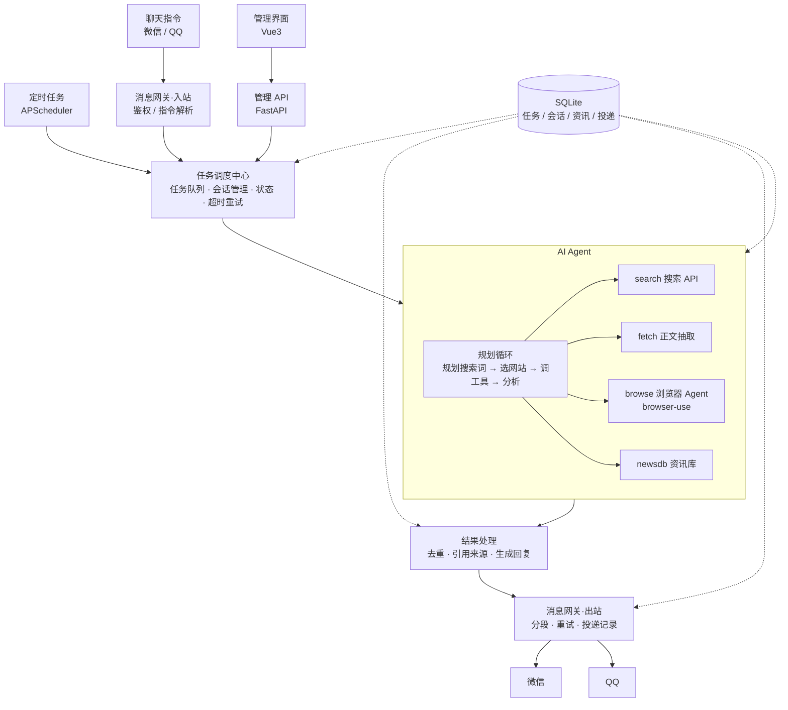
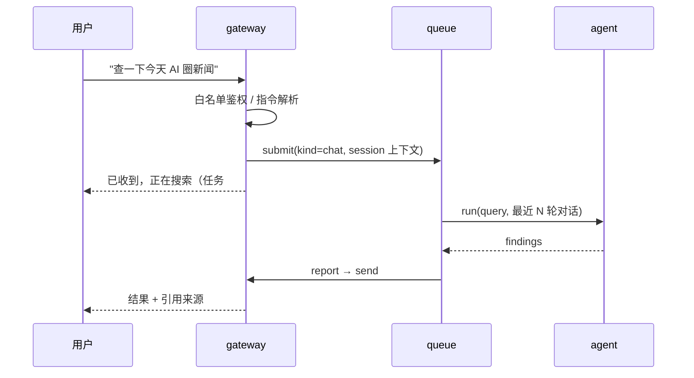
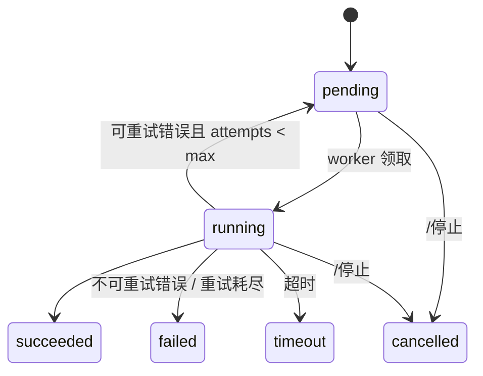

# 01 架构设计

## 1. 目标与场景

由大模型驱动搜索引擎和浏览器采集资讯，汇总后推送到微信 / QQ。两种场景**共用同一个 Agent 引擎**，只是触发方式不同：

| 场景 | 触发 | 说明 |
| --- | --- | --- |
| S1 定时推送 | 调度器（默认每天 21:00，Asia/Shanghai） | 按订阅主题生成日报，与历史推送去重后发送 |
| S2 聊天指令 | 微信 / QQ 收到消息 | 立即回执，长任务后台执行，完成后回复结果；支持追问 |

## 2. 总体架构



## 3. 技术选型

| 层 | 选型 | 理由 |
| --- | --- | --- |
| 语言 | Python 3.12 | browser-use、hermes-agent 均为 Python，可直接复用 |
| 包管理 | uv | 快、锁文件可复现 |
| API / Web | FastAPI + Uvicorn | 异步、自带 OpenAPI |
| 调度 | APScheduler 3.x（AsyncIOScheduler + SQLAlchemyJobStore） | 进程内 cron，持久化，无需额外中间件 |
| 任务队列 | asyncio 队列 + `task` 表持久化 | 单用户场景，不引入 Redis / Celery |
| 存储 | SQLite（WAL）+ SQLAlchemy 2.0 async + Alembic | 零运维；后续可切 PostgreSQL |
| LLM | OpenAI 兼容接口（openai SDK） | 可接 DeepSeek / 通义 / GPT 等 |
| 浏览器 Agent | browser-use + Chromium | 开源成熟的浏览器驱动 Agent 内核（pip 依赖，不拷贝） |
| 搜索 API | SearXNG（自建，免费）/ Tavily，统一接口 | 低成本优先走搜索，浏览器兜底 |
| 正文抽取 | httpx + trafilatura | 静态页面无需启动浏览器 |
| 消息网关 | 裁剪移植 hermes-agent `gateway/`：微信 = 腾讯 iLink Bot API（HTTP 长轮询），QQ = 官方 Bot API v2（WebSocket + REST）；httpx + websockets | MIT 协议，成熟；见 [08-porting.md](08-porting.md) |
| 管理界面 | Vue 3 + Vite + TypeScript + Naive UI | 轻量，构建后由 FastAPI 托管静态文件 |
| 测试 | pytest、pytest-asyncio、respx、pytest-cov；vitest | 见 [05-testing.md](05-testing.md) |
| 质量 | ruff（lint + format）、mypy | 由 `scripts/check.py` 统一执行 |
| 部署 | Docker Compose | 单机一键启动 |

## 4. 模块说明

| 模块 | 目录 | 职责 | 关键接口 |
| --- | --- | --- | --- |
| core | `src/newsbot/core/` | 配置、日志、数据库、ORM 模型、错误类型、LLM 客户端 | `settings`、`get_logger()`、`session()`、`llm.chat()` |
| gateway | `src/newsbot/gateway/` | 平台适配器（微信 / QQ）、白名单鉴权、聊天指令、入站路由、出站投递 | `BaseAdapter`、`MessageEvent`、`router.send()` |
| dispatcher | `src/newsbot/dispatcher/` | 任务队列与 worker、超时重试取消、会话上下文、定时调度、执行流水线 | `queue.submit()`、`queue.cancel()`、`scheduler.sync()` |
| agent | `src/newsbot/agent/` | 规划循环 + 工具（search / fetch / browse / newsdb） | `runner.run(query, ctx) -> Findings` |
| result | `src/newsbot/result/` | 去重、引用编号、摘要成稿、按平台格式化与分段 | `dedup.filter()`、`report.build()` |
| api | `src/newsbot/api/` | 管理后台 REST、登录鉴权、托管前端静态资源 | `/api/*` |
| web | `web/` | 管理界面：仪表盘、任务、定时任务、资讯库、推送记录、设置 | — |

### 4.1 Agent 内核设计（两层）

1. **规划循环（runner）**：LLM tool-calling 循环，负责拆解问题、生成搜索词、挑选来源、判断信息是否充分。设有步数、token、耗时三重预算。
2. **浏览器子 Agent（browse 工具）**：仅当页面是动态渲染 / 需要交互时调用 browser-use 执行子任务，返回提取到的文本。

优先级：`newsdb`（已有）→ `search` → `fetch` → `browse`。大部分问题在前三步解决，浏览器作为兜底，显著降低耗时与成本。

### 4.2 执行流水线

`dispatcher/pipeline.py`：`agent.runner.run()` → `result.dedup.filter()` → `result.report.build()` → `Sender.send()`。
`Sender` 由 `app.py` 启动时注入（实际实现为 `gateway.router.send`），dispatcher 不直接 import gateway。

## 5. 场景时序

### S1 定时推送


### S2 聊天指令



### 聊天指令表

| 指令 | 作用 |
| --- | --- |
| 直接发文字 | 视为查询任务 |
| `/搜 <内容>` | 显式查询 |
| `/订阅 <主题> [HH:MM]` | 新增定时推送（默认 21:00） |
| `/退订 <编号>` | 删除定时推送 |
| `/任务` | 查看最近任务及状态 |
| `/停止 [编号]` | 取消正在执行的任务 |
| `/帮助` | 指令说明 |

## 6. 数据模型

| 表 | 关键字段 | 说明 |
| --- | --- | --- |
| `task` | id, kind(scheduled/chat/manual), query, status, platform, chat_id, attempts, error, created_at, started_at, finished_at | 任务记录与状态 |
| `schedule` | id, cron, topics(json), platform, chat_id, enabled | 定时推送配置，调度器据此同步 job |
| `chat_session` | platform, chat_id, user_id, history(json), updated_at | 最近 N 轮对话，用于追问 |
| `news_item` | id, url, url_hash, title, source, published_at, content_hash, simhash, fetched_at | 资讯库，去重依据 |
| `report` | id, task_id, content, sources(json), created_at | 生成的回复 / 日报 |
| `delivery` | id, report_id, platform, chat_id, content, status(pending/sent/failed/waiting_user), attempts, error, sent_at | 投递记录；`content` 保存待发文本，使无报告的推送也能补投；`waiting_user` 等待用户下次发消息时补投 |
| `llm_usage` | id, task_id, model, prompt_tokens, completion_tokens, created_at | 成本统计 |

## 7. 任务状态机



- 默认：任务超时 600s、最多重试 2 次（仅 `RetriableError`），agent 并发 2，浏览器并发 1。
- 进程重启时，`running` 状态任务重置为 `pending`（恢复机制）。

## 8. 依赖方向（强制）

```
api, gateway  →  dispatcher  →  agent, result  →  core
```

- 只能沿箭头方向 import，禁止反向和同层横向（`agent` 与 `result` 互不 import）。
- 反向通信（dispatcher 发消息）通过 `app.py` 注入回调实现。
- `scripts/check.py` 校验 import 方向。

## 9. 配置与密钥

- 非敏感配置：`config.yaml`（提交 `config.example.yaml`）。
- 敏感信息：`.env`（提交 `.env.example`，真实文件 gitignore）。
- 代码中只通过 `core.config.settings` 读取，禁止直接 `os.environ`。

## 10. 安全设计

| 风险 | 措施 |
| --- | --- |
| 密钥泄露 | 仅存 `.env`；日志脱敏；`check.py` 扫描疑似密钥 |
| 陌生人操控 bot | 网关白名单 + 配对码（参考 hermes `pairing.py`），未授权消息直接忽略 |
| 网页提示注入 | 网页内容一律视为不可信数据，作为工具结果传入并标注；Agent 无 shell / 写文件类工具 |
| SSRF | `fetch` / `browse` 禁止访问内网与回环地址，限制协议为 http/https |
| 管理后台暴露 | 默认仅监听 `127.0.0.1`；口令登录 + HttpOnly / SameSite Cookie；修改类接口校验 CSRF |
| SQL 注入 | 一律使用 ORM / 参数化查询 |
| 资源失控 | 任务超时、浏览器步数上限、单任务 token 预算、下载禁用 |

## 11. 非功能要求

- **可观测**：每个任务一条 trace id，贯穿日志；管理界面可看任务步骤与耗时。
- **成本**：`llm_usage` 记录每任务 token；超出日预算后定时任务降级为“仅搜索 + 摘要”。
- **稳定性**：适配器断线自动重连（指数退避）；投递失败重试 3 次后记录并在后台告警。
- **送达**：微信 / QQ 都限制 bot 主动发消息，定时推送必须有补投递与双通道兜底，详见 [08-porting.md](08-porting.md) 第 3.4 节。
