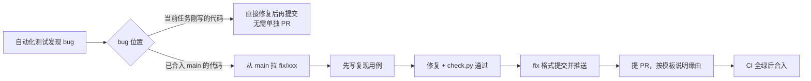

# 06 Git 与推送规范

## 1. 分支

| 分支 | 用途 | 规则 |
| --- | --- | --- |
| `main` | 稳定主干 | 受保护：禁止直接推送、禁止 force push；必须 PR + CI 全绿 |
| `feat/m{N}-{模块}` | 里程碑开发 | 每个任务完成即推送 |
| `fix/{简述}` | 修复已合入 `main` 的 bug | 必须提 PR 并说明原因 |
| `chore/`、`docs/` | 杂项、文档 | 同样走 PR |

## 2. 提交格式（commit-msg hook 校验）

```
<type>(<scope>): <中文摘要，≤ 50 字>

<正文：做了什么、为什么>

任务: T2.3
```

- `type`：`feat` `fix` `refactor` `test` `docs` `chore` `perf` `wip`
- `scope`：模块名，如 `gateway`、`dispatcher`、`agent`、`result`、`api`、`web`、`core`
- 一个提交只做一件事；格式化与逻辑修改分开提交。

### fix 类提交必须包含三段

```
fix(gateway): 微信长消息被截断

问题原因: 分段按字符计数，未考虑 emoji 占 2 个 UTF-16 单元，超出平台上限被服务端截断
修复方式: base.split_text 改为按平台计数规则计算长度，并留 5% 余量
注意事项: QQ 计数规则不同，已分别配置；旧的投递记录不受影响

任务: T2.6
关联: #12
```

缺少 `问题原因:` / `修复方式:` / `注意事项:` 任一项，hook 拒绝提交。

## 3. 推送时机

| 时机 | 动作 |
| --- | --- |
| 单个任务完成且 `check.py` 通过 | commit → push 到模块分支 → 更新 [03-tasks.md](03-tasks.md) 状态 |
| 会话即将结束但任务未完成 | `wip(scope): ...` 提交并推送到模块分支（绝不推 `main`），防止代码丢失 |
| 里程碑全部任务完成 | 提 PR → CI 全绿 → 合入 `main`（merge commit，保留逐任务历史）→ 打 tag |

## 4. Bug 处理流程



PR 必须使用 [.github/pull_request_template.md](../.github/pull_request_template.md)，bug 类 PR 必须填写：问题现象、问题原因、修复方式、注意事项、回归测试。

## 5. 本地 Git 钩子

钩子位于 `scripts/hooks/`，克隆仓库后执行一次即可启用：

```powershell
git config core.hooksPath scripts/hooks
```

| 钩子 | 作用 |
| --- | --- |
| `pre-commit` | 执行 `scripts/check.py --fast`，未通过则拒绝提交 |
| `commit-msg` | 校验提交信息格式；fix 类必须含问题原因 / 修复方式 / 注意事项 |

需要临时绕过时用 `git commit --no-verify`，但 [第 6 节](#6-禁止事项) 禁止在正常开发中使用。

## 6. 常用命令

```powershell
# 任务完成
python scripts/check.py
git add -A; git commit; git push -u origin feat/m2-gateway

# 里程碑完成，创建 PR 并在 CI 通过后自动合并
gh pr create --base main --fill --body-file .github/pull_request_template.md
gh pr merge --auto --merge

# 修 bug
git switch main; git pull; git switch -c fix/weixin-split
```

## 7. 禁止事项

- `git push --force` 到共享分支、`git reset --hard` 丢弃他人改动
- `--no-verify` 跳过 hooks
- 提交 `.env`、`data/`、密钥、Cookie、浏览器 profile
- 在一个 PR 中混入与任务无关的修改
